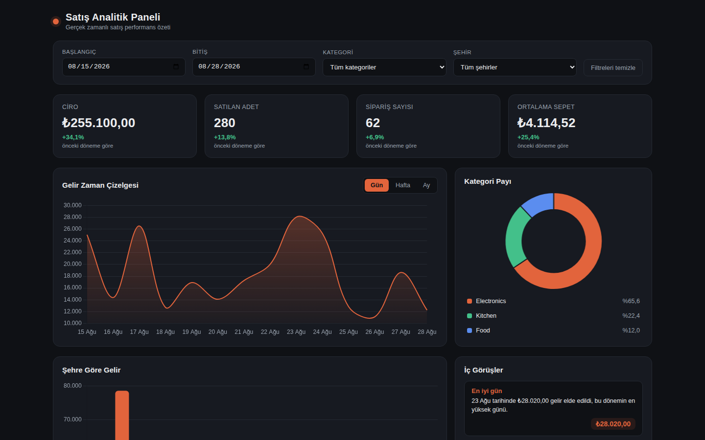
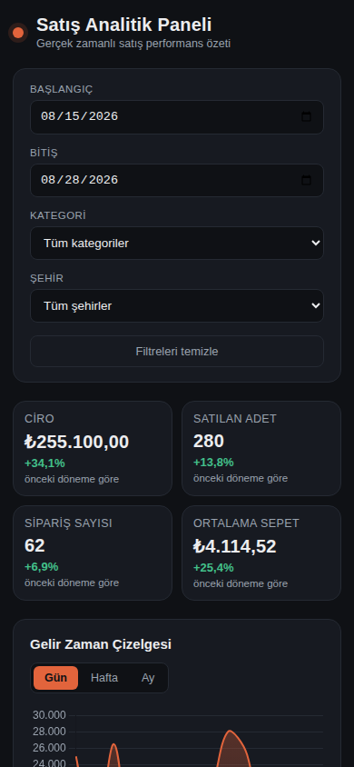

# Satış Analitik Paneli

A sales analytics dashboard over a 120 row CSV: four KPI cards with period over period change,
a revenue timeline, a category donut, a city bar chart, a searchable product table, one filter
bar that drives every widget, and an insight panel the server computes. Turkish interface,
premium dark look, no build step.

Built by a team of Claude Code sub agents from a single prompt:
[`prompts/apps/data-dashboard.md`](../../prompts/apps/data-dashboard.md). The team at work,
with the contract it agreed on before writing a line and every bug QA caught, is in
[`BUILD-LOG.md`](BUILD-LOG.md).

## Run it

```bash
npm install
node server.js        # then open http://localhost:3000
```

`PORT=3001 node server.js` moves it to another port. Node 24 or newer, because `server.js` uses
the built in `node:sqlite` (on Node 22.x that module sits behind `--experimental-sqlite`).
`data.sqlite` is created and seeded on the first start: inside this repo it imports
`data/sales-data.csv` from the repo root, and from an empty folder it generates 120 realistic
rows instead. Deleting `data.sqlite` resets the app.

## Screenshots

| Desktop, 1440x900 | Phone, 390x844 |
|---|---|
|  |  |

The whole page at 1440 width: [`dashboard-desktop-full-1440x1800.png`](screenshots/dashboard-desktop-full-1440x1800.png)

## Features

1. **Four KPI cards.** Ciro, satılan adet, sipariş sayısı and ortalama sepet, each with the
   percent change against the previous period of the same length. When the filtered range has
   no previous period the card says so instead of inventing a number.
2. **Revenue timeline** with a gün / hafta / ay granularity switch, redrawn from the server on
   every switch.
3. **Category donut** with percentage labels. Clicking a slice applies that category filter,
   clicking it again removes it.
4. **City bar chart** sorted by revenue, with revenue and units both in the tooltip.
5. **Product table** with sortable columns, an instant search box, and revenue, units and share
   of total per product.
6. **One filter bar** (date range, category, city) driving every widget from a single state
   object, with a visible "filtreleri temizle" reset.
7. **Insight panel.** The server computes 3 to 5 observations from the filtered rows (best day,
   standout category, biggest mover against the previous period, leading city, one concrete
   suggested action), each carrying the number behind it. The frontend only renders them.
8. **Premium dark look** with one accent color, Turkish number formatting with ₺ on money, and a
   layout that still reads at 390px phone width.

## The team that built it

| Role | Model | Effort | What it delivered |
|---|---|---|---|
| Orchestrator | Claude Opus 5 | high | published the contract, integrated the parts, reviewed the running app, wrote this README and the build log |
| Backend Lead | Claude Sonnet | medium | `package.json`, `server.js`, the SQLite schema, the CSV import and the row generator, every aggregation route, the insight engine |
| Frontend Lead | Claude Sonnet | medium | `public/index.html`, `public/style.css`, `public/app.js`: KPI cards, three charts, filter bar, product table, insight panel, the dark theme |
| QA Lead | Claude Sonnet | medium | turned the six acceptance items into real browser and curl checks, found five bugs, fixed them, re-verified |
| Three fix workers | Claude Sonnet | low | the twelve defects the QA pass and the orchestrator review left behind, listed in the build log |

The two leads ran at the same time in separate sessions on separate ports. They never read each
other's files: the contract in `BUILD-LOG.md` is the only reason their halves fit together.

## Verified

Checked on a clean machine state: `node_modules` deleted, reinstalled from scratch,
`data.sqlite` deleted, then `PORT=3000 node server.js`.

| # | Check | Result | Evidence |
|---|---|---|---|
| 1 | `npm install` then `node server.js` start clean, http://localhost:3000 renders real data with no console errors | **pass** | 70 packages installed in one run, server logged its URL, `curl` returned HTTP 200, and a CDP console listener recorded zero errors and zero warnings at both 1440x900 and 390x844 |
| 2 | `curl -s localhost:3000/api/kpis` returns non zero revenue, units and orders | **pass** | revenue 445390, units 526, orders 120 |
| 3 | The last 7 days change the KPI cards, timeline, donut, city chart and table at once, and the table total matches the revenue card | **pass** | `?from=2026-08-22&to=2026-08-28`: KPI revenue 128160, product table total 128160, sum of the rows 128160, and every widget redrew in the browser |
| 4 | Month granularity redraws with fewer, wider points | **pass** | 28 points at day granularity against 1 at month granularity on this one month CSV, and the single point is drawn with a visible radius |
| 5 | `curl -s localhost:3000/api/insights` returns 3 to 5 insights, each carrying a number | **pass** | 4 insights on the full range, 5 on a filtered range, 3 on the thinnest filter, every one with a numeric `value` |
| 6 | At 390px nothing overflows sideways and the widgets stack readably | **pass** | `document.documentElement.scrollWidth` is 390 against a `clientWidth` of 390, and the phone frame shows a two by two KPI grid over stacked widgets |

Also checked: `PORT=3001` really moves the port, deleting `data.sqlite` reseeds to 120 rows,
Chart.js is served from `/vendor` and never from a CDN, and every route answers HTTP 200 with
JSON even when the filters are malformed.
