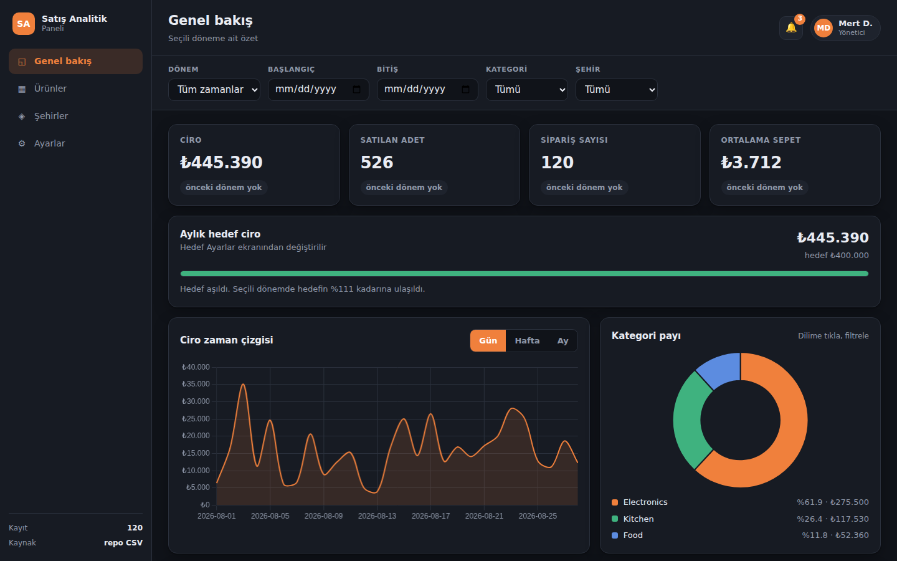
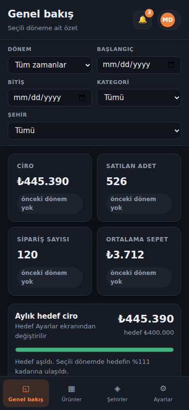
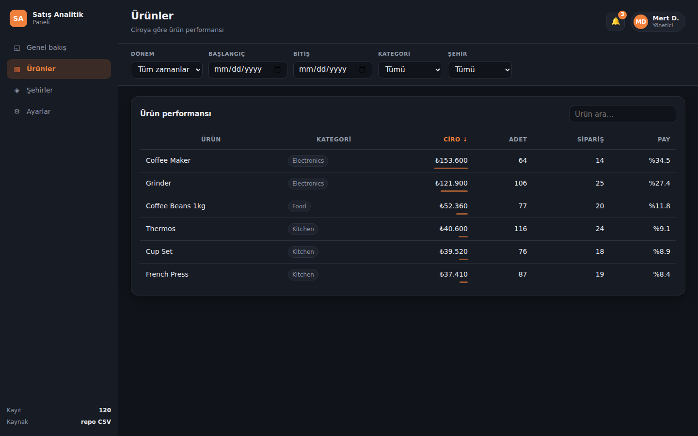
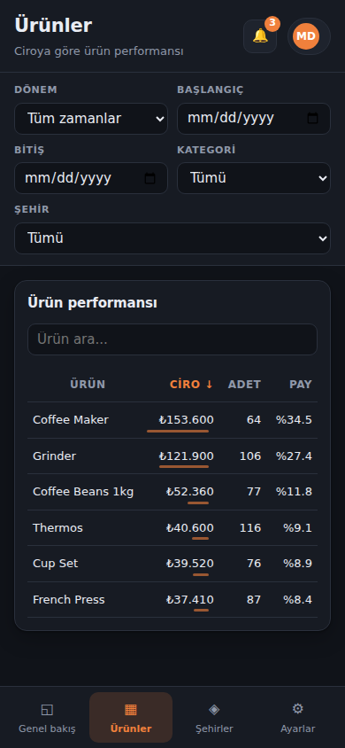
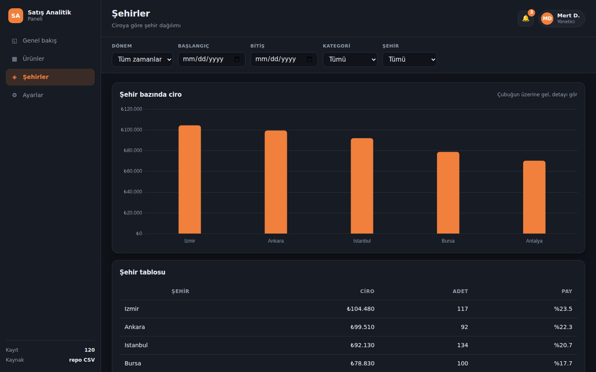
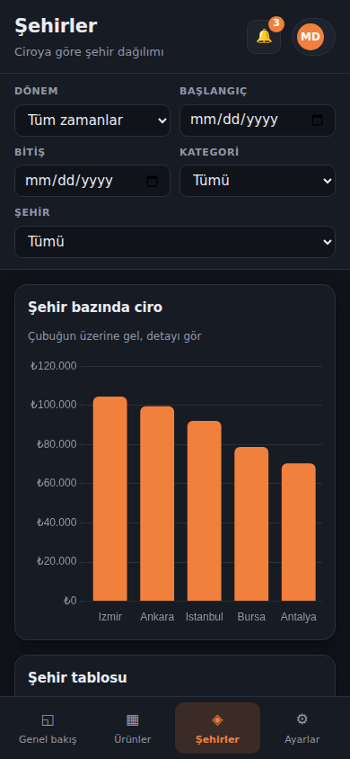
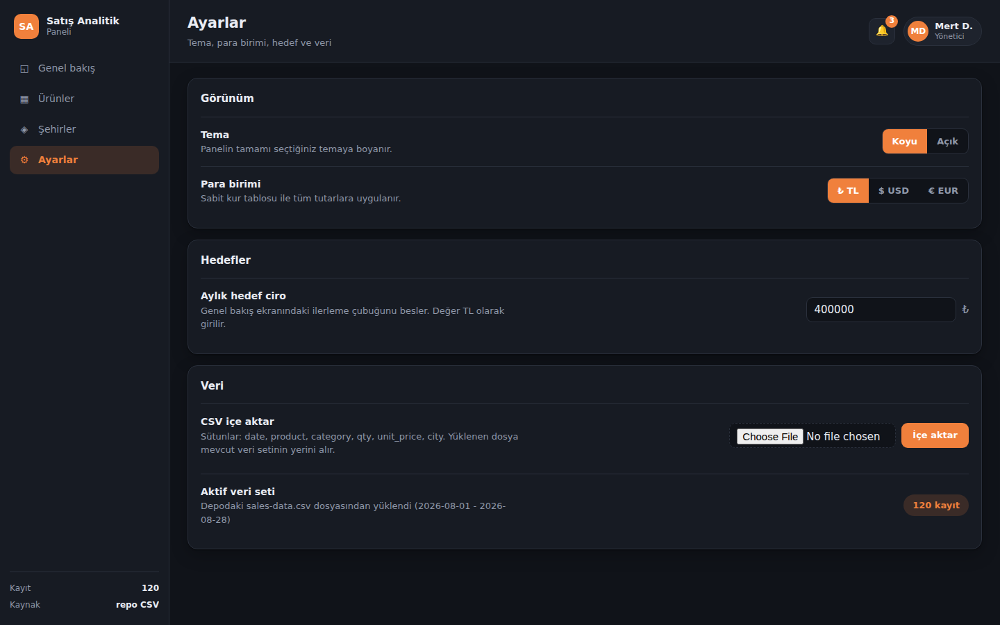
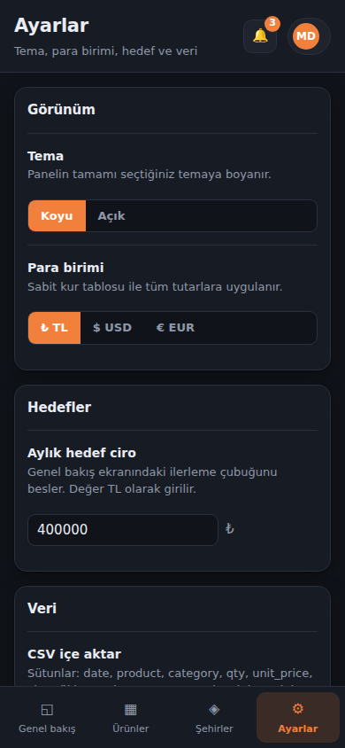

# Satış Analitik Paneli

Bir CSV üzerinden çalışan satış analitik paneli: bir önceki döneme göre değişimi gösteren KPI
kartları, grafikler, tüm ekranları aynı anda süren tek bir filtre çubuğu ve sunucunun hesapladığı
bir içgörü paneli. Tek bir prompt'tan, bir ajan takımı tarafından yapıldı:
[`../../prompts/apps/data-dashboard.md`](../../prompts/apps/data-dashboard.md) dosyası olduğu
gibi yeni bir Claude Code oturumuna yapıştırıldı. Node 24 ya da daha yenisi, Express ve Node'un
içinde hazır gelen `node:sqlite` modülü: derleme adımı yok, framework yok, TypeScript yok,
derlenmesi gereken hiçbir şey yok.

## Çalıştır

```bash
npm install
node server.js
```

Sonra http://localhost:3000 adresini aç. `PORT=3001 node server.js` yazarsan port değişir.
Veritabanı ilk açılışta oluşturulup dolduruluyor; uygulamayı sıfırlamak için `data.sqlite`
dosyasını sil.

Sunucu ilk açılışta depodaki `data/sales-data.csv` dosyasını (sütunlar:
`date,product,category,qty,unit_price,city`) bulabilirse onu içeri alıyor, bulamazsa aynı
sütunlarla 120 satırlık gerçekçi veri üretiyor. Yani uygulama boş bir klasörde de çalışıyor.

## Ekran görüntüleri

| Masaüstü, 1440x900 | Telefon, 390x844 |
|---|---|
|  |  |
|  |  |
|  |  |
|  |  |

## Özellikler

1. **Ürün kabuğu.** Üstte ürün adının, en önemli üç içgörüyü listeleyen bir bildirim zilinin ve
   bir profil rozetinin durduğu bir çubuk; yanda dört ekranlı bir menü (Genel bakış, Ürünler,
   Şehirler, Ayarlar); veri gelirken iskelet yükleyiciler ve filtrelere hiçbir şey uymadığında
   her bileşende Türkçe bir boş durum mesajı. Her ekranın kendi URL adresi var, yani tarayıcının
   geri tuşu da doğrudan bağlantı da çalışıyor.
2. **Genel bakış.** Dört KPI kartı (ciro, satılan adet, sipariş sayısı, ortalama sepet); her biri
   aynı uzunluktaki önceki döneme göre yüzde değişimi taşıyor. Yanında da hedef geçilince yeşile
   dönen aylık ciro hedefi çubuğu var.
3. **Ciro zaman çizelgesi**, gün / hafta / ay kırılımı arasında geçiş yapan bir anahtarla.
4. **Kategori payı halkası**, yüzde etiketleriyle ve tıklanabilir bir gösterge listesiyle: bir
   dilimi seçtiğinde o kategori tüm uygulamaya filtre olarak uygulanıyor.
5. **Ürünler ve Şehirler.** Ürün başına ciro, adet ve pay için sıralanabilir sütunlar ve anında
   arama kutusu; ciroya göre sıralanmış, ipucu balonunda ciro, adet ve payı gösteren bir şehir
   çubuk grafiği ve aynı sayıların tablo hali.
6. **Tek filtre çubuğu** (hazır dönem ya da özel tarih aralığı, kategori, şehir) bütün ekranları
   tek bir durumdan sürüyor; bir filtre etkinken beliren bir "filtreleri temizle" düğmesi var.
7. **İçgörü paneli.** Sunucu, filtrelenmiş satırlardan 3 ile 5 arası çıkarım hesaplıyor: en iyi
   gün, öne çıkan kategori, dönemin iki yarısı arasında en çok hareket eden başlık, en zayıf şehir
   için önerilen bir aksiyon ve ortalama sepet tutarı. Her biri arkasındaki sayıyı da taşıyor.
8. **Gerçekten bir şeyi değiştiren Ayarlar**, hepsi localStorage'da saklanıyor: tema (koyu /
   açık), para birimi (TL, USD, EUR; sabit bir kur tablosu üzerinden, grafikler ve içgörüler dahil
   uygulamadaki her para rakamına uygulanıyor), ilerleme çubuğunu besleyen aylık hedef ciro ve veri
   setinin yerine geçen bir CSV içeri alma.

Kullanıcının gördüğü bütün metinler Türkçe. Kod ve kod yorumları İngilizce; bu belge Türkçe.

## Takım

| Rol | Reçetenin görevlendirdiği model | Efor | Sorumlu olduğu iş |
|---|---|---|---|
| Orkestratör | Opus 5 | high | Kimse tek satır yazmadan önce sözleşmeyi yayımladı, parçaları birleştirdi, en sonda QA'yı yürüttü |
| Backend Lideri | Sonnet | medium | `server.js`, SQLite şeması, CSV içeri alma ve satır üreticisi, bütün toplulaştırma uçları, içgörü motoru |
| Frontend Lideri | Sonnet | medium | `public/index.html`, `public/style.css`, `public/app.js`, kabuk, dört ekran, KPI kartları, grafikler ve filtre çubuğu |
| QA Lideri | Sonnet | medium | Kabul kontrol listesini gerçek testlere çevirdi, sunucuyu başlattı, her maddeyi tarayıcıda ve curl ile doğruladı, madde madde geçti ya da kaldı diye raporladı |

Orkestratörün en başta yayımladığı sözleşme, testlerin tam kaydı, QA'nın bulduğu beş hata ve
bağımsız doğrulama geçişinde çıkan üç düzeltme [BUILD-LOG.md](BUILD-LOG.md) dosyasında. O dosya
bu özel yapımın nasıl ilerlediğini de not ediyor: yapım oturumunda Agent aracı kullanılamadığı için
orkestratör üç lider rolünü aynı sözleşmeye karşı üç ayrı geçişte kendisi yürüttü.

## Doğrulandı

Her madde çalışan bir sunucuya karşı, tarayıcıda DevTools protokolü üzerinden ya da curl ile
kontrol edildi, sonra da bağımsız bir doğrulama geçişinde temiz bir kurulum üzerinde baştan
tekrarlandı; kanıtı [BUILD-LOG.md](BUILD-LOG.md) dosyasında.

| # | Kontrol | Sonuç |
|---|---|---|
| 1 | `npm install` ve ardından `node server.js` temiz başlıyor, http://localhost:3000 gerçek veriyi konsolda tek bir hata olmadan çiziyor ve yan menü dört ekranın hepsine ulaşıyor | geçti |
| 2 | `curl -s localhost:3000/api/kpis` sıfırdan farklı ciro, adet ve sipariş döndürüyor | geçti, 445390 / 526 / 120 |
| 3 | Tarih aralığını son 7 güne almak KPI kartlarını, zaman çizelgesini, halkayı, şehir grafiğini ve ürün tablosunu aynı anda değiştiriyor ve tablo toplamı ciro kartıyla birebir uyuyor | geçti, ikisi de 128160 |
| 4 | Ayarlar'da temayı açık, para birimini USD yapmak bütün uygulamayı ve her para rakamını yeniden boyuyor, sayfa yenilenince ikisi de korunuyor, aylık hedef ciroyu yükseltmek ilerleme çubuğunu oynatıyor | geçti |
| 5 | `curl -s localhost:3000/api/insights` her biri bir sayı taşıyan 3 ile 5 arası içgörü döndürüyor | geçti, 5 içgörü |
| 6 | 390px genişlikte hiçbir şey yana taşmıyor, yan menü toplanıyor ve bileşenler alt alta diziliyor | geçti, dört ekranda da 0px taşma |
| 7 | `PORT=3999 node server.js` verilen portta hizmet veriyor | geçti |
| 8 | Temiz kontrol: `rm -rf node_modules`, `npm install`, başlat, `GET /` 200 dönüyor ve `/api/kpis` JSON cevaplıyor | geçti |
