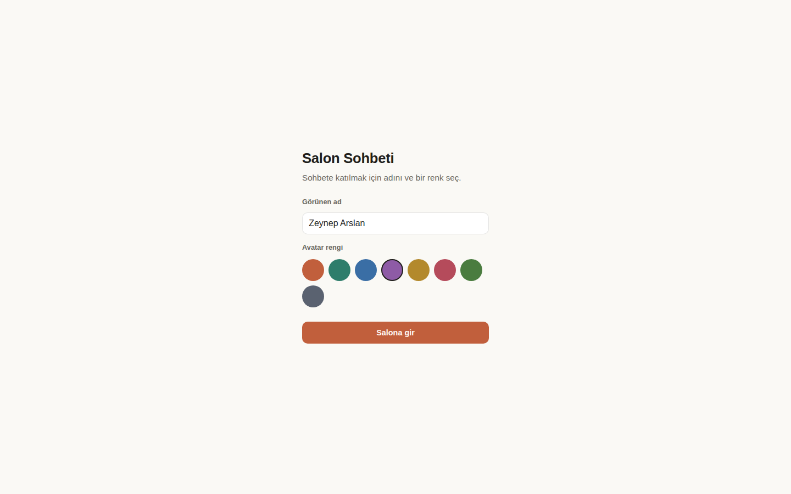
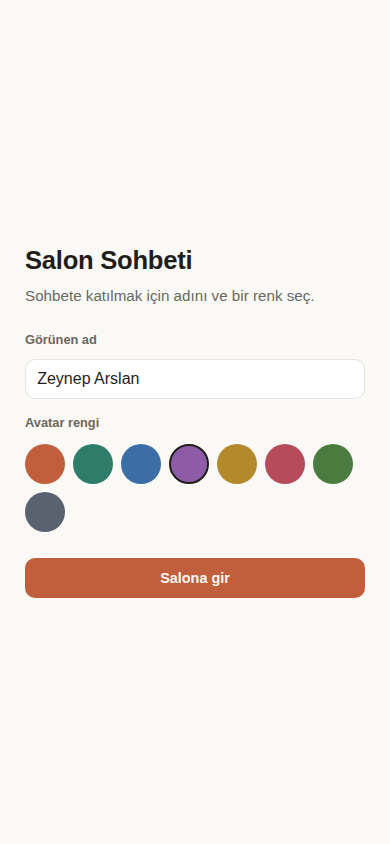
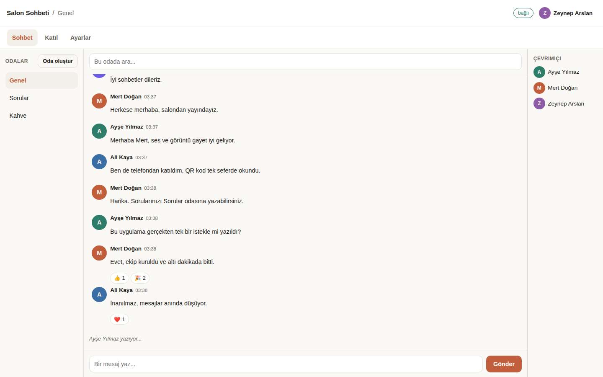
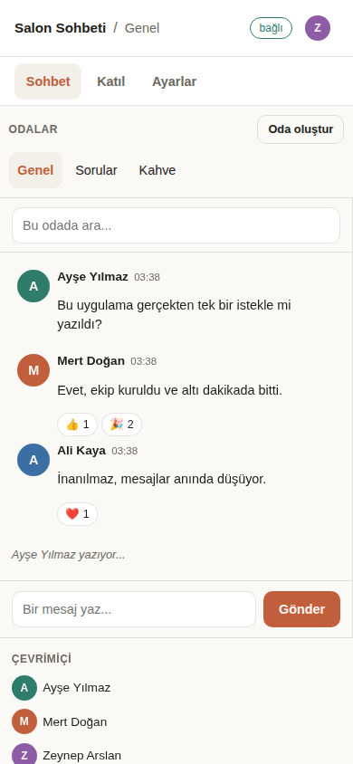
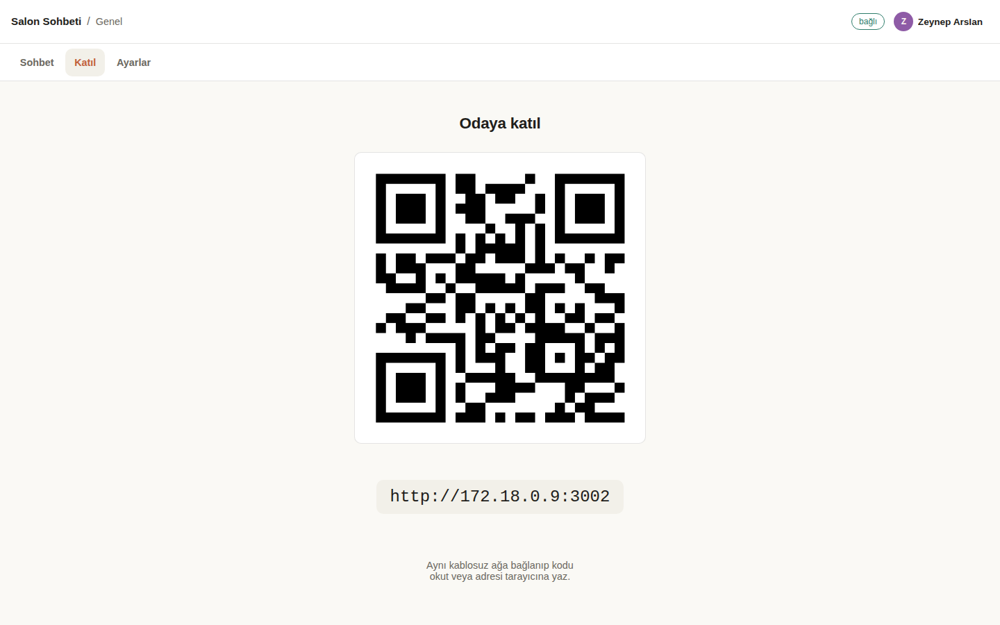
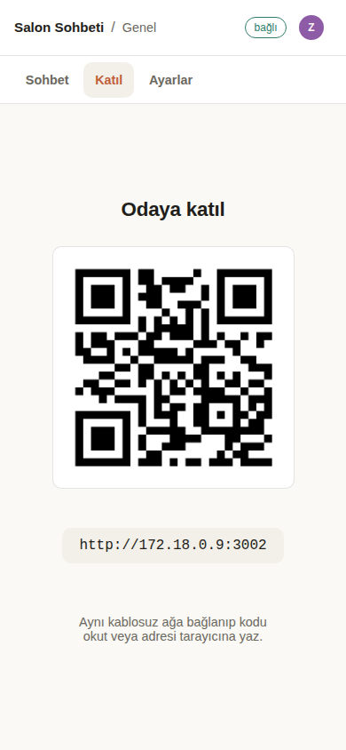
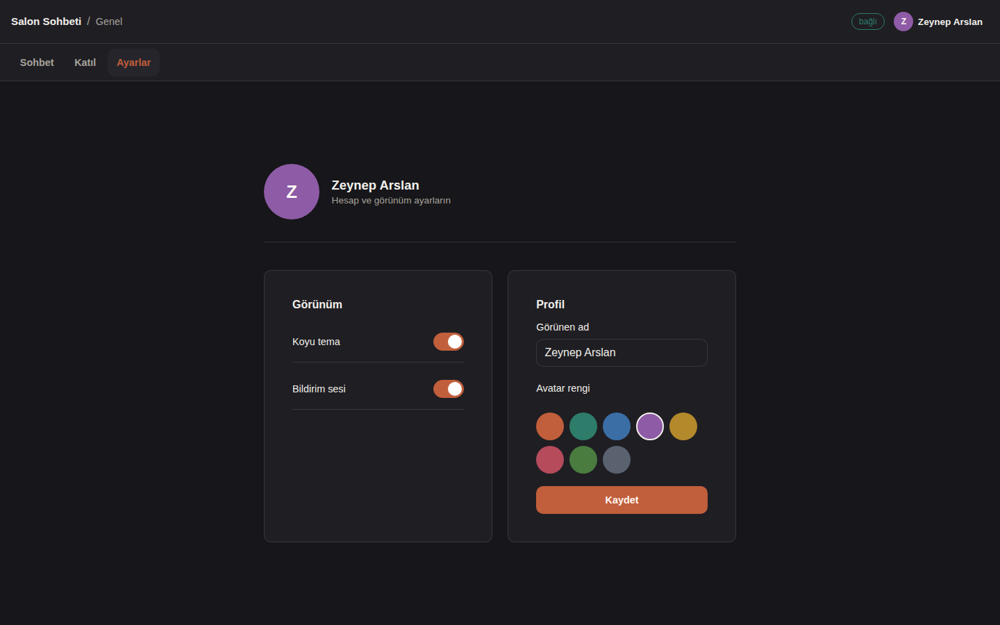
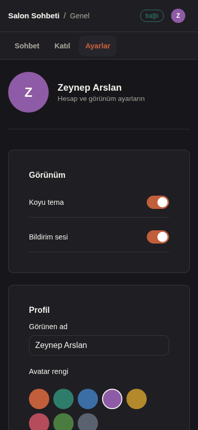
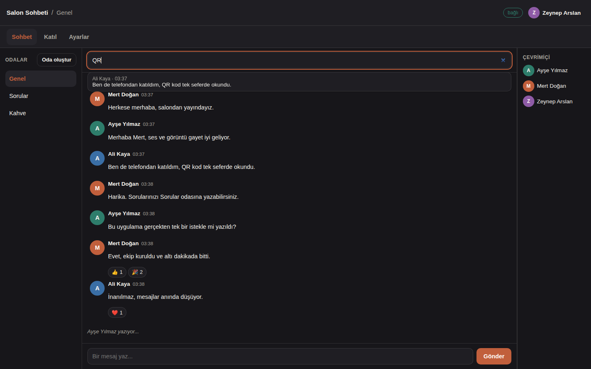

# Salon Sohbeti

Bütün bir salonun katılabileceği gerçek zamanlı bir sohbet ürünü: odalar, WebSocket üzerinden anlık
mesajlar, kimin çevrimiçi olduğu ve "yazıyor..." göstergesi, emoji tepkileri, geçmişte arama,
gerçekten bir şeyi değiştiren bir ayarlar ekranı ve projeksiyonda duran bir katılım QR kodu, yani
aynı wifi'daki telefonlar doğrudan içeri giriyor. Tek bir prompt'tan, bir ajan takımı tarafından
yapıldı: [`../../prompts/apps/live-chat.md`](../../prompts/apps/live-chat.md) dosyası olduğu gibi
yeni bir Claude Code oturumuna yapıştırıldı. Node 24 ya da daha yenisi, Express, `ws`, `qrcode` ve
Node'un içinde hazır gelen `node:sqlite` modülü: derleme adımı yok, framework yok, TypeScript yok,
derlenmesi gereken hiçbir şey yok.

## Çalıştır

```bash
npm install
node server.js
```

Sonra http://localhost:3000 adresini aç. `PORT=3001 node server.js` yazarsan port değişir.
Veritabanı ilk açılışta oluşturulup dolduruluyor; uygulamayı sıfırlamak için `data.sqlite`
dosyasını sil.

## Telefondan katılım

Sunucu `0.0.0.0` adresine bağlanıyor ve açılışta iki adres yazdırıyor:

```
Salon Sohbeti çalışıyor.
  Bu bilgisayar : http://localhost:3000
  Aynı wifi     : http://192.168.1.20:3000
```

İkincisi, `os.networkInterfaces()` ile bulunan LAN adresi. Projeksiyonda **Katıl** ekranını aç: o
adresi kocaman bir QR kodu olarak gösteriyor. Aynı wifi'daki herkes okutuyor ve giriş ekranına
düşüyor. Mekan cihazlar arası trafiği engelliyorsa, yan yana açılmış iki tarayıcı penceresi de tam
olarak aynı şeyi gösteriyor.

## Ekran görüntüleri

| Masaüstü, 1440x900 | Telefon, 390x844 |
|---|---|
|  |  |
|  |  |
|  |  |
|  |  |



Masaüstündeki Sohbet karesi gerçek bir üç kişilik konuşma: aynı anda bağlı üç istemci, canlı tepki
sayıları, sağda çevrimiçi listesi ve mesaj kutusunun üstünde "Ayşe Yılmaz yazıyor...".

## Özellikler

1. **Giriş ekranı.** Bir görünen ad ve sekiz avatar renginden biri, `localStorage` içinde
   hatırlanıyor; yani sayfayı yenileyen kişi doğrudan uygulamaya geri giriyor.
2. **Ürün kabuğu.** Üstte ürün adının, etkin odanın ve Ayarlar'ı açan bir profil rozetinin durduğu
   bir çubuk; üç ekrana ulaşan bir menü (Sohbet, Katıl, Ayarlar) ve her ekranın kendi URL adresi,
   yani tarayıcının geri tuşu da doğrudan bağlantı da çalışıyor; ilk kare gelene kadar bir yükleniyor
   durumu, her listede Türkçe bir boş durum mesajı ve üstel geri çekilmeyle yeniden bağlanırken
   "bağlı" ya da "yeniden bağlanılıyor..." yazan bir bağlantı rozeti.
3. **Odalar.** İlk açılışta Genel, Sorular ve Kahve kuruluyor; bir de "Oda oluştur" düğmesi ve
   bakmadığın odalara düşen mesajları sayan, oda başına bir okunmamış rozeti var.
4. **Anlık mesajlar.** WebSocket üzerinden gidiyor, yayınlanmadan önce SQLite'a yazılıyor ve biri
   katıldığında son 50 tanesi geçmiş olarak yükleniyor. Aynı kişinin beş dakika içindeki arka arkaya
   mesajları tek bir avatarın altında gruplanıyor. Liste, sen yukarı kaydırıp okumaya başlamadıkça
   hep en yeni mesaja yapışık kalıyor.
5. **Kimin çevrimiçi olduğu ve yazma göstergesi.** Odada kimin olduğunu canlı gösteren bir liste ve
   biri yazarken beliren, yazmayı bıraktıktan dört saniye sonra kaybolan bir "yazıyor..." satırı;
   yani cümlenin ortasında düşen bir istemci geride takılı kalan bir şey bırakmıyor.
6. **Emoji tepkileri.** Her mesaja 👍 ❤️ 😂 🎉 👏; kişi başına açılıp kapanıyor ve sayılar bütün
   pencerelerde aynı anda güncelleniyor.
7. **Arama.** Oda geçmişinde arıyor, her sonucu yazarı ve saatiyle listeliyor; bir sonuca
   tıklayınca o mesaja atlayıp onu vurguluyor.
8. **Gerçekten bir şeyi değiştiren Ayarlar**, hepsi `localStorage` içinde saklanıyor: tema (koyu /
   açık, anında bütün uygulamaya uygulanıyor), bildirim sesi (başkasından mesaj geldiğinde kısa bir
   ton) ve görünen adla avatar renginin değiştirilmesi, ki bu hem profil rozetini hem de her
   pencerenin seni gördüğü hali anında güncelliyor.
9. **Katılım QR kodu.** `/api/join`, LAN adresini ve `qrcode.toDataURL` ile üretilmiş bir QR veri
   adresini döndürüyor; Katıl ekranı da ikisini arka sıradan okunacak kadar büyük gösteriyor.

Kullanıcının gördüğü bütün metinler Türkçe. Kod ve kod yorumları İngilizce; bu belge Türkçe. Tek bir
vurgu rengi, açık ve koyu tema, 390px genişlikte yana taşma yok.

## Takım

Yapıştırılan istem, Claude Code oturumunu ORKESTRATÖR yaptı. Önce sözleşmeyi yayımladı, sonra alt
ajanlardan bir takım kurdu. Orkestratör tek satır uygulama kodu yazmadı: parçaları birleştirdi,
sonucu gerçek ekran görüntülerine bakarak yargıladı ve yeterince iyi olmayan işi geri gönderdi.

| Rol | Model | Efor | Sorumlu olduğu iş |
|---|---|---|---|
| Orkestratör | ana Claude Code oturumu | high | Sözleşme, entegrasyon, yargı, bu README, BUILD-LOG.md ve ekran görüntüleri |
| Backend Lideri | Sonnet | medium | `server.js`, SQLite şeması ve ilk verisi, WebSocket merkezi, API, LAN IP adresi ve QR |
| Frontend Lideri | Sonnet | medium | `public/`, giriş ekranı, kabuk, sohbet görünümü, Katıl ve Ayarlar |
| QA Lideri | Sonnet | medium | Kontrol listesinin gerçek testlere dönüşü, iki kişi yerine iki istemci ve kalan maddelerin düzeltilmesi |
| Frontend Lideri, ikinci tur | Sonnet | medium | Ekran görüntüsü incelemesinden sonraki düzen yeniden kurulumu |
| CSS işçisi | Sonnet | low | Telefondaki ortalanmış taşma kırpılması düzeltmesi |

Backend Lideri ile Frontend Lideri aynı anda çalıştı. Bu ancak sözleşmenin en başta yayımlanmış
olması sayesinde mümkün: Frontend Lideri, henüz diskte var olmayan bir API için eksiksiz bir
istemci yazdı ve ilk birleştirmede oturdu. Sözleşmenin tamamı, QA'nın çalıştırdığı her şey ve
bulunup düzeltilen sekiz hata [BUILD-LOG.md](BUILD-LOG.md) dosyasında.

## Doğrulandı

Son düzeltmeden sonra sıfırdan çalıştırıldı: `rm -rf node_modules`, sonra
`npm install --no-audit --no-fund` (469 ms'de 98 paket), sonra `PORT=3002 node server.js`.

| # | Kontrol | Sonuç | Kanıt |
|---|---|---|---|
| 1 | Temiz açılış, iki adres de yazdırılıyor, `/` uygulamayı sunuyor | **geçti** | Açılışta `Salon Sohbeti çalışıyor.` satırıyla birlikte `http://localhost:3002` ve `http://172.18.0.9:3002` yazdırıldı; `GET /` 6197 baytlık HTML ile 200 döndü; yüklemede konsolda hata yok |
| 2 | İki kişi, mesaj bir saniyenin altında karşıya geçiyor, ikisi de çevrimiçi listesinde | **geçti** | İki WebSocket istemcisi "Ayşe" ve "Mert" olarak katıldı; mesaj 51 ms'de vardı; çevrimiçi listesi `Ayşe, Mert` döndü |
| 3 | Yazma göstergesi beliriyor ve kayboluyor; bir tepki öteki pencerede güncelleniyor | **geçti** | Karşı taraf önce `typing:true`, sonra `typing:false` gördü; Mert'in 🎉 tepkisi Ayşe'ye `{"🎉":["u_clean_m"]}` olarak ulaştı |
| 4 | Yeniden başlatma bütün odaları, mesajları ve tepkileri koruyor | **geçti** | Sunucu kapatılıp yeniden açıldı: mesaj ve 🎉 tepkisi `/api/rooms/1/messages` üzerinden geri geldi, geçmiş yeniden yüklendi |
| 5 | Arama önceki bir kelimeyi buluyor; `/api/join` LAN adresini ve bir QR döndürüyor | **geçti** | `?q=temiz` mesajı buldu; `/api/join`, `http://172.18.0.9:3002` adresini ve 3778 karakterlik bir PNG veri adresi döndürdü |
| 6 | Ayarlar sayfa yenilemesini atlatıyor; 390px'te hiçbir şey yana taşmıyor | **geçti** | Tema ve bildirim sesi yenilemeden sonra da duruyordu; Sohbet, Katıl ve Ayarlar ekranlarında `scrollWidth === 390`, masaüstü boyutunda `scrollWidth === 1440` |

`GET /api/health`, `{"ok":true,"app":"salon-sohbeti","uptimeSec":2}` cevabını veriyor;
`GET /api/rooms` ise Genel, Sorular ve Kahve odalarını listeliyor. Sunucu sonrasında kapatıldı ve
portun boşaldığı doğrulandı.
