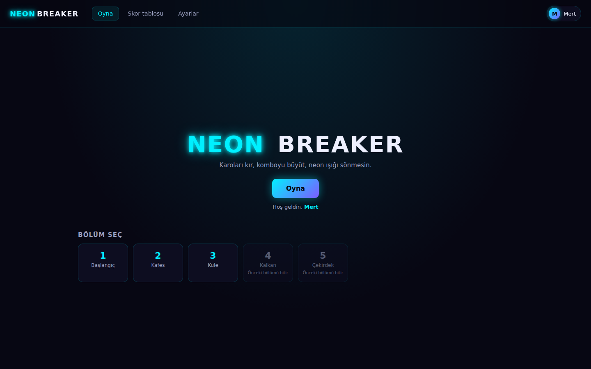
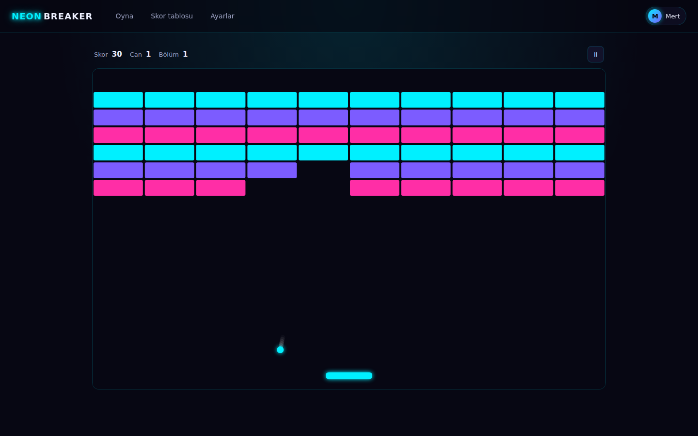

# Neon Breaker

Küçük bir bağımsız arcade oyunu gibi oynanan, canvas üzerine kurulu bir Breakout: gerçek bir his
veren raket fiziği, gittikçe hızlanan beş bölüm, yağmur gibi düşen güçlendirmeler, parçacıklar,
sentezlenmiş ses, beş başarım ve yeniden başlatmayı atlatan bir skor tablosu. Tek bir prompt'tan,
bir ajan takımı tarafından yapıldı:
[`../../prompts/apps/neon-breaker.md`](../../prompts/apps/neon-breaker.md) dosyası olduğu gibi yeni
bir Claude Code oturumuna yapıştırıldı. Node 24 ya da daha yenisi, Express ve Node'un içinde hazır
gelen `node:sqlite` modülü: derleme adımı yok, framework yok, TypeScript yok, derlenmesi gereken
hiçbir şey yok.

## Çalıştır

```bash
npm install
node server.js
```

Sonra http://localhost:3000 adresini aç. `PORT=3001 node server.js` yazarsan port değişir.
Veritabanı ilk açılışta oluşturulup dolduruluyor; uygulamayı sıfırlamak için `data.sqlite`
dosyasını sil. Sunucu `0.0.0.0` adresine bağlanıyor, yani aynı wifi'daki bir telefon açılışta
yazdırılan LAN adresinden uygulamaya ulaşabiliyor.

## Ekran görüntüleri

| | Masaüstü, 1440x900 | Telefon, 390x844 |
|---|---|---|
| Başlangıç ekranı | `screenshots/01-start-desktop.png` | `screenshots/01-start-phone.png` |
| Skor tablosu | `screenshots/02-skor-tablosu-desktop.png` | `screenshots/02-skor-tablosu-phone.png` |
| Ayarlar | `screenshots/03-ayarlar-desktop.png` | `screenshots/03-ayarlar-phone.png` |
| Oyunun ortası | `screenshots/04-oyun-desktop.png` | `screenshots/04-oyun-phone.png` |




## Özellikler

1. **Ürün kabuğu.** Neon Breaker logosunun yer aldığı bir başlangıç ekranı, `localStorage` içinde
   hatırlanan oyuncu adını taşıyan bir profil çipi, üç ekran arasında gezinme (Oyna, Skor tablosu,
   Ayarlar), bölümler temizlendikçe açılan bir bölüm seçme ekranı ve devam, yeniden başla ile
   ayarlar seçeneklerini sunan bir duraklatma menüsü.
2. **His veren raket fiziği.** Sekme açısı, topun rakete nereden çarptığına bağlı: orta nokta topu
   dümdüz yollar, kenarlar 60 dereceye kadar açar. Çarpışma; duvarlara, rakete ve yaşayan her
   tuğlaya karşı süpürme yöntemiyle hesaplanır, böylece hızlı bir top asla içinden geçip kaçmaz.
   Düz yatay bir döngüye takılan top ise 1.2 saniye sonra normal bir açıya itilir, yani bir tur
   hiçbir zaman tıkanıp kalmaz.
3. **Beş bölüm, üç tuğla tipi.** Başlangıç, Kafes, Kule, Kalkan ve Çekirdek; her birinin kendi
   deseni ve 1.00'dan 1.45'e kadar çıkan kendi hız çarpanı var. Tuğlalar normal, iki vuruşluk
   (ilk vuruşta gözle görülür biçimde çatlarlar) ya da kırılmaz olabiliyor. Beş bölümün hepsi
   Ayarlar'daki etkin temanın neon paletiyle çizilir, yani tema değişince beşi birden yeniden
   boyanır.
4. **Güçlendirmeler.** Çoklu top, geniş raket, yavaş top ve ekstra can kırılan tuğlalardan düşer ve
   raketle yakalanır. Süreli olanların her biri HUD'da bir geri sayım çipi gösterir ve çip sıfıra
   indiğinde gözle görülür biçimde çalışmayı bırakır.
5. **Şeker tadında ayrıntılar.** Her kırılışta tuğlanın renginde bir parçacık patlaması, can
   kaybında ekran sarsıntısı, kombo yükseldikçe büyüyen kombo yazısı, topun arkasında bir iz ve Web
   Audio ile sentezlenen ses: rakette bir bip, satıra göre perdelenen bir tuğla tonu, yakalamada bir
   çıngırak, kayıpta bir gümbürtü. Hiç ses dosyası yok.
6. **Beş başarım**, her biri kazanıldığı anda bir bildirim çıkarıyor ve Skor tablosu ekranında
   kazanıldı ya da kilitli olarak listeleniyor: İlk Bölüm, Kayıpsız, Kombo 10, Güç Toplayıcı,
   Beş Bin.
7. **SQLite üzerinde bir skor tablosu.** İsim, skor, bölüm ve tarih; Skor tablosu ekranında ilk 10,
   yeni gönderilen kayıt vurgulanmış halde. POST isteği ismi ve skoru sunucu tarafında doğrular:
   boş bir isim, negatif bir skor ya da içinde işaretleme taşıyan bir isim Türkçe bir mesajla
   reddedilir ve hiçbir şey yazılmaz.
8. **Oyunu gerçekten değiştiren Ayarlar**, anında uygulanıyor ve `localStorage` içinde saklanıyor:
   ses açık/kapalı, zorluk (kolay, orta, zor: top hızı ve başlangıç canları), tema (üç neon palet;
   nebula, asit ve magma; tuğlaları, raketi ve arka planı sayfa yenilenmeden yeniden boyar) ve
   raket boyu (kısa, orta, uzun). Ayrıca bir onay adımının ardındaki İlerlemeyi sıfırla.

**Kontroller.** Raketi hareket ettir: fare, sol ve sağ ok tuşları ya da parmakla sürükleme. Topu
fırlat: tıklama, dokunma veya yukarı ok. Duraklat: `Space` (ya da `Esc`, ya da HUD'daki duraklat
düğmesi). Devam et: duraklatma menüsündeki "Devam", 3-2-1 geri sayımının ardından.

Boş ve yükleniyor durumları boş bırakılmadı, tasarlandı: skor tablosu yüklenirken, API hata
verdiğinde skor tablosu, henüz hiçbir şey kazanılmamışken başarım listesi ve bölüm seçme ekranındaki
kilitli kartlar. Düzen masaüstünde yatay, telefonda dikey ve 390px genişlikte yana taşma olmadan
oynanabilir. Kullanıcının gördüğü bütün metinler Türkçe, çünkü salon Türkçe konuşuyor. Kod ve kod
yorumları İngilizce; bu belge Türkçe.

## Takım

İstem, bir Claude Code oturumunu ORKESTRATÖR yaptı. Önce sözleşmeyi yayımladı (dosya listesi, port,
JSON şekilleriyle birlikte API yolları, bölüm tanımı, tur sonucu), sonra gerçek ve birbirinden ayrı
ajan süreçleri olarak üç lider alt ajan başlattı. Backend ile Frontend paralel çalıştı; sözleşmeye
karşı, birbirlerine karşı değil.

| Rol | Model | Efor | Sorumluluğu |
|---|---|---|---|
| Orkestratör | Fable 5.1 | high | Sözleşme, entegrasyon, görsel inceleme, bu README ve `BUILD-LOG.md` |
| Backend Lideri | Sonnet | medium | `package.json`, `server.js`, `node:sqlite` şeması, tohum verisi, skor tablosu API'si ve doğrulaması, beş bölüm ve beş başarım |
| Frontend Lideri | Sonnet | medium | `public/index.html`, `public/style.css`, `public/app.js`: kabuk, canvas oyun döngüsü, fizik, güçlendirmeler, parçacıklar, ses ve HUD |
| QA Lideri | Sonnet | medium | Kabul kontrol listesini gerçek tarayıcı ve curl kontrollerine çevirdi; içinden geçip kaçan topları, takılan topları ve skor tablosu girdi istismarını avladı, bozuk olanı düzeltti |
| Frontend işçileri | Sonnet | low ila medium | Orkestratörün yapılan işi inceledikten sonra istediği üç hedefli düzeltme turu: Türkçe tipografi, düzen, skor tablosundaki skorlar ve oyna ipucu |

İlk birleştirmede bulunan altı hata, teslimden sonraki bağımsız doğrulama turunda çıkan üç hata ve
hikayenin tamamı [BUILD-LOG.md](BUILD-LOG.md) içinde.

## Doğrulandı

Her madde QA Lideri tarafından gerçek bir tarayıcıda ya da curl ile kontrol edildi, ardından
orkestratör tarafından temiz bir kurulumda yeniden kontrol edildi. 4. maddeyi bağımsız doğrulama
turu bir yanlış geçiş olarak yakaladı; aşağıdaki sonuç, `BUILD-LOG.md` içindeki 7. maddenin
düzeltmesinden sonraki halidir.

| # | Kontrol | Sonuç |
|---|---|---|
| 1 | `npm install` ve ardından `node server.js` temiz açılıyor, başlangıç ekranı logosuyla yükleniyor, üç menü ekranı da açılıyor ve tarayıcı konsolu sessiz | geçti |
| 2 | 1. bölüm temizlenebiliyor: son tuğla kırılıyor, farklı desenli 2. bölüm yükleniyor, bölüm seçmede kilidi açılıyor ve bir başarım bildirimi çıkıyor | geçti |
| 3 | `Space` oyunu duraklatıyor ve top yerinde donuyor, devam 3-2-1 geri sayımından sonra kaldığı yerden sürdürüyor, bölüm boyunca top ne içinden geçip kaçıyor ne de oyun alanından çıkıyor | geçti |
| 4 | Bir güçlendirme düşüyor, yakalanıyor, geri sayım çipi gösteriyor ve sıfırda gözle görülür biçimde çalışmayı bırakıyor | geçti, düzeltmeden sonra: yavaş topta 260 -> 156 -> 261.5 piksel/saniye |
| 5 | Ayarlar'da tema anında yeniden boyuyor, zorluk zor topu hızlandırıyor, sesi kapatmak susturuyor ve sayfa yenilendiğinde dört ayar da korunuyor | geçti |
| 6 | Boş isim ve negatif skorla `POST /api/scores` Türkçe bir mesajla HTTP 400 döndürüyor, `GET /api/scores` yeniden başlatmayı atlatan bir ilk 10 döndürüyor ve 390px'te sürükleme raketi hareket ettiriyor | geçti |
| 7 | Temiz kontrol: `rm -rf node_modules`, `npm install`, açılış, `GET /` 200 döndürüyor ve `/api/health` JSON cevap veriyor | geçti |

3. madde için kanıt: en yoğun bölümde 1500 fizik adımı boyunca saniyede 2000 ila 9700 piksel hızla
sürülen top sol, sağ ve üst duvarları sıfır kez geçti; zorla yatayın yakınına sokulan bir döngü ise
yaklaşık 1.2 saniye içinde kendiliğinden düzeldi. 6. madde için kanıt: 5000 karakterlik bir isim,
yalnızca boşluklardan oluşan bir isim, `<script>` ve `` içeren isimler, metin
olarak gönderilen bir skor, `1e999`, `1.5`, negatif bir skor, bölüm 0, bölüm 99, null bir gövde,
dizi bir gövde ve eksik content-type; hepsi Türkçe bir mesajla HTTP 400 alarak reddedildi ve satır
sayısı hiç kıpırdamadı.
