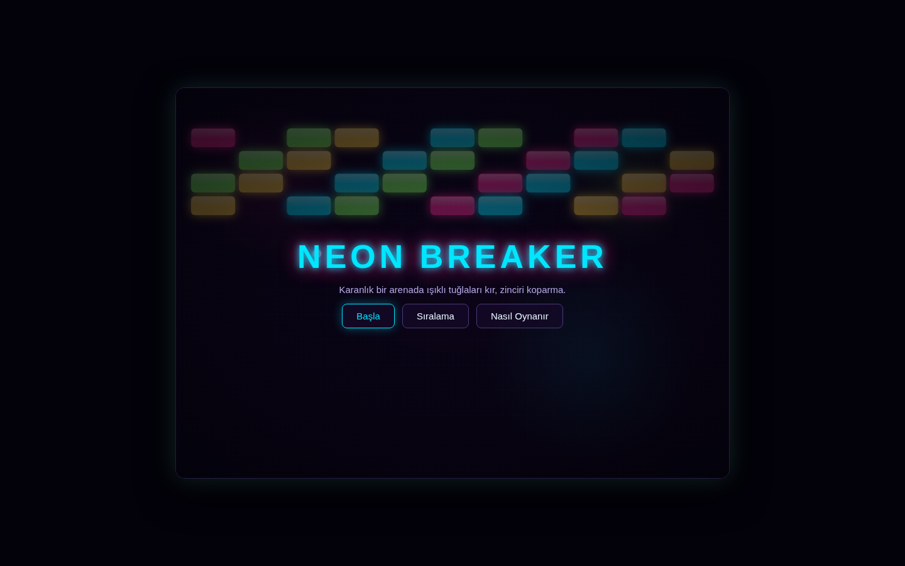
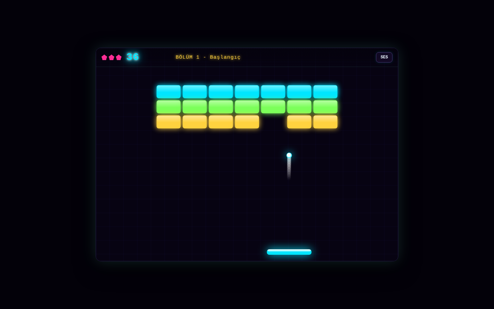
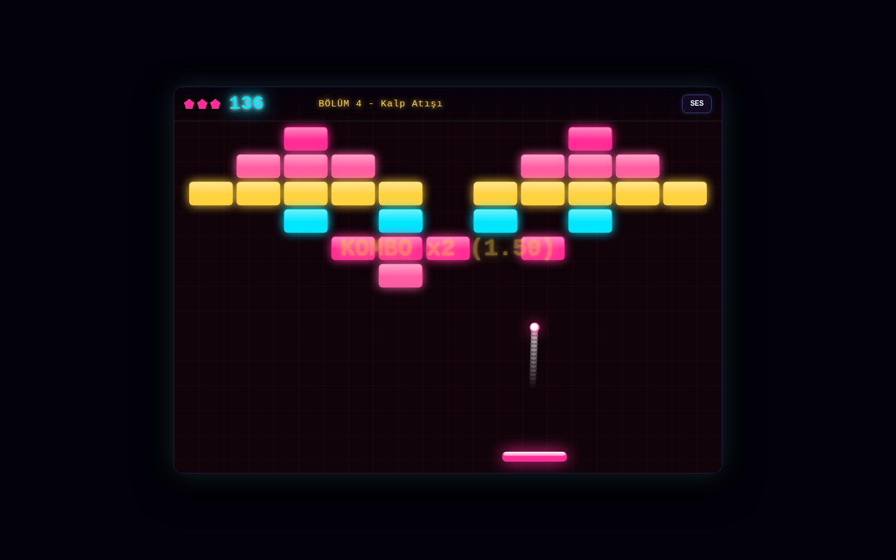
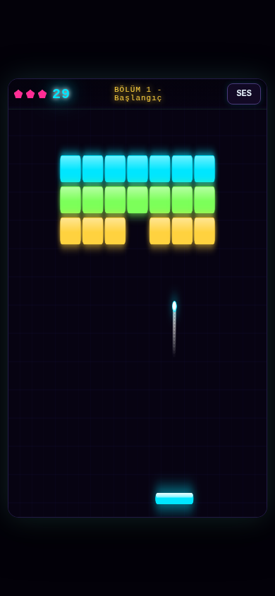

# Neon Breaker

A canvas Breakout that behaves like a small indie arcade release: paddle physics with a feel,
five levels that speed up, power-ups raining down, particles, synthesized sound, and a
leaderboard that survives a restart. Built in one pass by a team of Claude Code sub-agents from a
single pasted prompt (`prompts/apps/neon-breaker.md`). All the on-screen text is Turkish.

## The two commands

```bash
npm install
node server.js        # then open http://localhost:3000
```

`PORT=3001 node server.js` runs it on another port. Node 24 or newer (the built-in `node:sqlite`
module needs no flag there). `data.sqlite` is created and seeded with demo scores on first start;
delete it and the app resets itself.

## Controls

| input | action |
|---|---|
| Left / Right arrow, A / D, or the mouse | move the paddle |
| Space | launch the ball, and pause or resume |
| Esc | pause |
| M, or the SES button | mute and unmute |
| Enter | submit your score on the game over panel |
| drag on the canvas (touch) | move the paddle |
| tap (touch) | launch the ball |

## Features

1. **Paddle physics with feel.** The bounce angle depends on where the ball lands on the paddle:
   dead centre goes straight up, the outer edge deflects up to 60 degrees. Speed rises per level
   and creeps up during a level. Collision is swept and sub-stepped, so a fast ball never tunnels
   through a brick or a wall, and a near-flat or near-vertical loop is nudged back to a normal
   angle.
2. **Five levels**, each with its own pattern and neon palette: Başlangıç, Piramit, Kale, Kalp
   Atışı, Son Kale. Three brick types: normal, two-hit (visibly cracked after the first hit) and
   unbreakable. The levels live on the server and are served over `/api/levels`.
3. **Power-ups** fall from broken bricks and are caught with the paddle: Çoklu Top, Geniş Raket,
   Yavaş Top, Ekstra Can. Each timed one shows a countdown chip in the HUD and visibly stops when
   the chip reaches zero.
4. **Juice.** A particle burst in the brick's colour on every break, a screen shake when a life is
   lost, and a growing combo multiplier drawn over the field.
5. **Synthesized sound** through the Web Audio API, with no audio files: a paddle blip, a brick
   tone pitched by row, a chime on catching a power-up, a thud on losing a life. The mute state
   persists in localStorage.
6. **Neon HUD** with lives, score and level, and a pause on Space or Esc: the field blurs, the
   game state freezes exactly where it stood, and resuming runs a 3-2-1 countdown.
7. **Leaderboard in SQLite** (name, score, level, date), top 10, with the fresh entry highlighted.
   The POST validates the name and the score server-side and answers in Turkish.
8. **Touch and responsive.** The paddle follows the finger, a tap launches the ball, and the
   880x620 logical play field scales down to a 390px phone.

## The API

| route | answers |
|---|---|
| `GET /api/health` | `{ "ok": true, "name": "Neon Breaker", "levels": 5, "scores": 12 }` |
| `GET /api/levels` | the five level definitions |
| `GET /api/scores?limit=10` | the top 10, ordered by score |
| `POST /api/scores` | 201 with the entry, its rank and the new top 10, or 400 with a Turkish message |

## The team that built it

| role | what it owned | model | effort |
|---|---|---|---|
| Orchestrator | the contract, integration, judgement, screenshots, the docs | Opus 5 | high |
| Backend Lead | `server.js`, the SQLite schema and seed, the five levels, the leaderboard API and its validation | Sonnet | medium |
| Frontend Lead | `public/index.html`, `public/style.css`, `public/app.js`, the whole canvas game | Sonnet | medium |
| QA Lead | the acceptance checklist, the curl and browser checks, the bug hunt and the fixes | Sonnet | medium |

The leads ran in parallel on files that do not overlap, which only worked because the
orchestrator published the contract first. `BUILD-LOG.md` has that contract, the tests QA ran and
every bug that was found and fixed.

## Screenshots

| | |
|---|---|
|  |  |
| Start menu, 1440x900 | Level 1 mid-play with the HUD, 1440x900 |
|  |  |
| Level 4 "Kalp Atışı" and the combo text, 1440x900 | The same game on a 390x844 phone |

## Verified

Every item was checked by the QA Lead and then re-checked independently by the orchestrator, in a
headless Chromium driven over the DevTools protocol and with curl.

| # | check | result |
|---|---|---|
| 1 | `npm install` then `node server.js` start clean; the page shows the start screen with no console errors | PASS (zero console messages from `app.js` on load) |
| 2 | Level 1 can be cleared, level 2 loads with a different pattern, and Space pauses with the ball frozen | PASS (ball position identical to 15 decimal places across a 1.2s pause, moving again after the 3-2-1 resume) |
| 3 | A power-up drops, is caught, shows a countdown chip, and stops working when the chip hits zero | PASS (paddle 130 to 195 with the Geniş Raket chip at 6.1s, back to 130 with no chip when it expired) |
| 4 | Through a full level the ball never passes through a brick, nor leaves the play field | PASS (6000 physics steps on level 5: 0 escapes, 0 bricks broken away from the ball) |
| 5 | A bad POST returns HTTP 400 with a Turkish message, and the top 10 survives a restart | PASS (`{"ok":false,"error":"İsim 1 ile 12 karakter arasında olmalı."}`, and the posted score was still there after a real restart) |
| 6 | At 390px with touch emulation, dragging moves the paddle and a tap launches the ball | PASS (paddle 375 to 627 px on a touch drag, ball `launched: true`) |

Clean-room check: `node_modules` deleted, `npm install` from scratch, server started, `/` answered
HTTP 200 and `/api/health` answered JSON.
