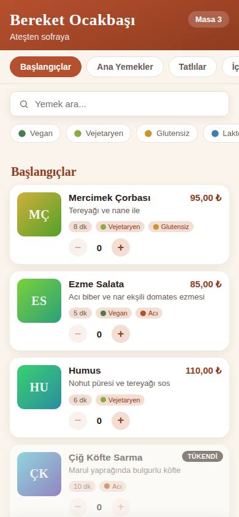
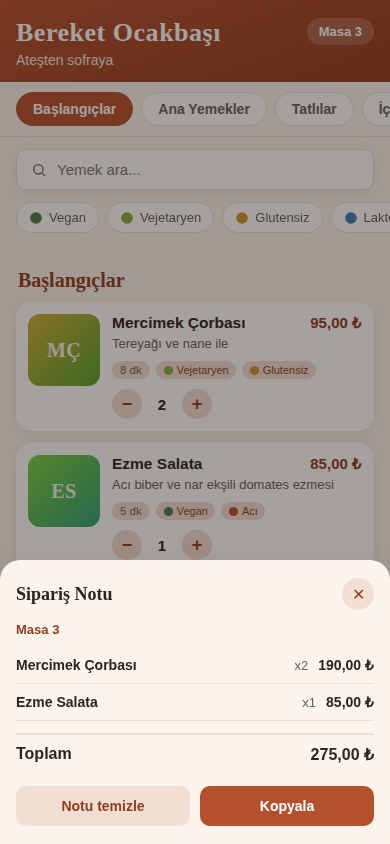
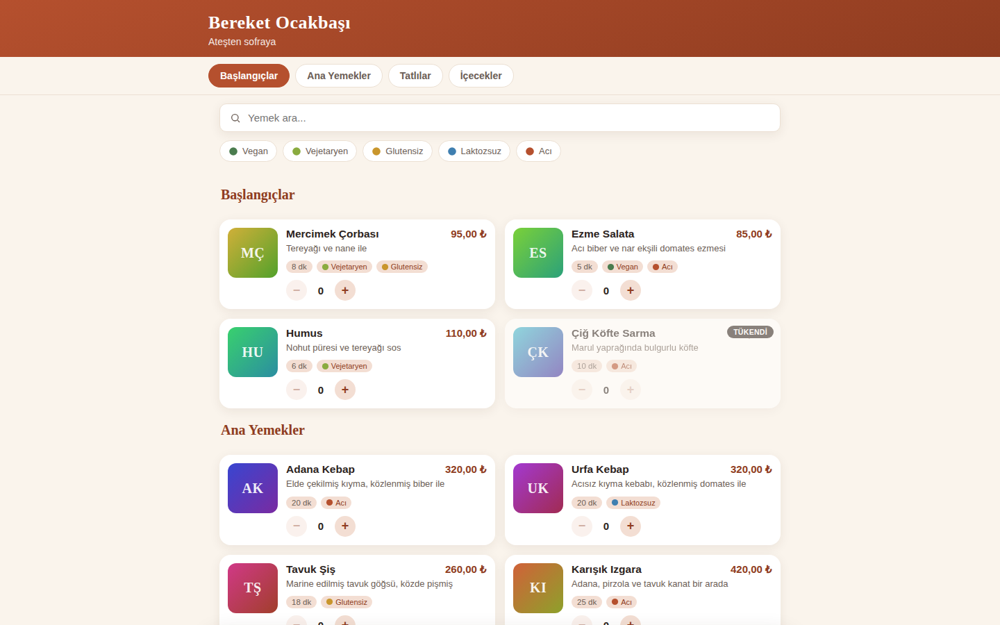
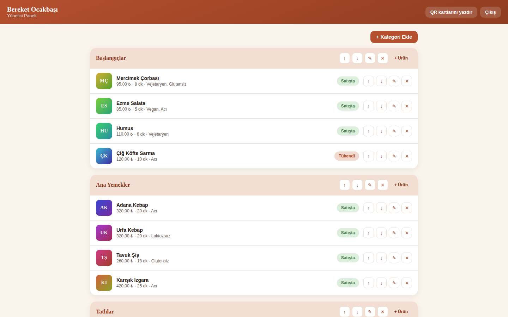

# QR Menü

The menu behind the QR code on a restaurant table, with two faces and one password between
them: a phone first customer menu with photos, allergen and diet tags, search, filter chips and
an order note the guest shows the waiter, and an admin panel where the owner edits the menu,
flips an item to sold out and prints a sheet of real QR table cards. Turkish interface, warm
restaurant look, no build step.

Built by a team of Claude Code sub agents from a single prompt:
[`prompts/apps/qr-menu.md`](../../prompts/apps/qr-menu.md). The team at work, with the contract
it agreed on before writing a line and every bug the review caught, is in
[`BUILD-LOG.md`](BUILD-LOG.md).

## Run it

```bash
npm install
node server.js        # then open http://localhost:3000
```

`PORT=3001 node server.js` moves it to another port. Node 24 or newer, because `server.js` uses
the built in `node:sqlite` (on Node 22.x that module sits behind `--experimental-sqlite`).
`data.sqlite` is created and seeded on the first start with 4 categories and 16 items; deleting
it resets the app.

**The admin panel** is at `/admin`. The password is a single constant at the very top of
`server.js`:

```js
// Change this one line to set the admin password.
const ADMIN_PASSWORD = 'kebap2026';
```

Change that line, restart, done. There is no user table and no registration: one password, a
signed session cookie, and every admin route checked on the server rather than only in the UI.

**A table's QR code** points at `/?masa=N`, so `http://localhost:3000/?masa=3` is what the guest
at table 3 sees. The printable A4 sheet of table cards is at `/admin/qr`.

## Screenshots

| Phone, 390x844 | The order note the guest shows the waiter |
|---|---|
|  |  |

| Desktop, 1440x900 | Admin panel |
|---|---|
|  |  |

The printable table cards at `/admin/qr`:
[`qr-cards-desktop-1440x900.png`](screenshots/qr-cards-desktop-1440x900.png)

## Features

1. **Customer face at `/`, designed at 390px first.** A sticky category rail that follows the
   scroll and jumps to a section on tap, item cards with a deterministic gradient placeholder
   image (two hues derived from the item id, no network request), the price, the description and
   the preparation time. Above 760px the same page centres into a two column grid so it still
   reads on a projector.
2. **Allergen and diet tags.** Five fixed tags (vegan, vejetaryen, glutensiz, laktozsuz, acı),
   each a coloured dot and its Turkish label, on the cards and as filter chips at the top.
   Several chips narrow together, and an instant search over name and description runs
   alongside them, tolerant of Turkish case and accents.
3. **The order note.** A plus and minus control on every available card, a bottom bar with the
   line count and the running total, and a panel listing the lines with the table number, the
   total, a "Kopyala" button that copies a plain text note and a "Notu temizle" button. It lives
   in `localStorage`, so a reload keeps it.
4. **Admin at `/admin` behind the password.** Full create, edit and delete for categories and
   items, with the five tags as checkboxes, and a one tap availability switch that flips an item
   to "Tükendi" and back.
5. **Ordering.** Up and down arrows move a category among the categories and an item within its
   category. The order is persisted and the customer face reflects it.
6. **Real QR codes.** The `qrcode` package renders one PNG per table server side as a data URL,
   pointing at `/?masa=N`, plus a printable A4 sheet of table cards at `/admin/qr` with dashed
   cut lines and a print button that disappears from the printed page.
7. **Live refresh.** The customer face polls the menu version every 3 seconds and, when the
   owner changes something, refetches and redraws with a discreet "menü güncellendi" toast,
   keeping the search text, the active chips and the order note.
8. **A warm restaurant look.** One terracotta accent on a warm off white ground, a serif for
   headings and a system sans for the body, no webfont and no CDN, and ₺ prices with Turkish
   separators (`145,00 ₺`).

## The team that built it

| Role | Model | Effort | What it delivered |
|---|---|---|---|
| Orchestrator | Claude Opus 5 | high | published the contract, integrated the parts, reviewed the running app, wrote this README and the build log |
| Backend Lead | Claude Sonnet | medium | `package.json`, `server.js`, the SQLite schema, the seed, every public and admin route, the signed session cookie, the QR generation and the printable sheet |
| Frontend Lead | Claude Sonnet | medium | `public/index.html`, `public/admin.html`, `public/style.css`, `public/app.js`: both faces, the order note, the live refresh and the look |
| QA Lead | Claude Sonnet | medium | turned the six acceptance items into real browser and curl checks, found and fixed the order note table number bug, re-verified |
| Backend fix worker | Claude Sonnet | low | the dead `laktozsuz` filter, 404 on unknown ids, the styling of the print sheet |
| Frontend fix worker | Claude Sonnet | medium | the desktop layout and the five tag icons the orchestrator review rejected |

The two leads ran at the same time, in separate sessions, on separate ports. They never read
each other's files: the contract in `BUILD-LOG.md` is the only reason their halves fit together.

## Verified

Checked on a clean machine state: `node_modules` deleted, reinstalled from scratch,
`data.sqlite` deleted, then `PORT=3002 node server.js` (port 3002 because three showcase apps
were being verified on the same machine; the app defaults to 3000).

| # | Check | Result | Evidence |
|---|---|---|---|
| 1 | `npm install` then `node server.js` start clean; the page shows 4 categories and 16 seeded items with no console errors | **pass** | 97 packages installed in one run, server logged its URL, `curl` returned HTTP 200, `/api/menu` returned 4 categories and 16 items, and a CDP console listener recorded zero errors and zero warnings at 1440x900, at 390x844, on `/admin` and on `/admin/qr` |
| 2 | `curl -s -X POST /api/admin/items` with no session cookie returns HTTP 401, and `/admin` without a login shows only the login form | **pass** | 401 with `{"error":"unauthorized"}` on every `/api/admin/*` route, `/admin/qr` redirects 302, and with the cookies cleared `/admin` renders "Yönetici Girişi" plus a password field, with no panel markup in the DOM |
| 3 | Flipping an item to sold out in an admin tab shows the badge in a customer tab within 5 s | **pass** | in a page opened before the flip, the "Tükendi" badge appeared **0.41 s** after the API call, with the "menü güncellendi" toast |
| 4 | `/admin/qr` renders table cards; the code for table 3 opens `/?masa=3`, note shows table 3 | **pass** | 12 cards rendered with cut lines; table 3's PNG is byte identical to a fresh `QRCode.toDataURL('http://localhost:3002/?masa=3')`, and loading that URL shows "Masa 3" in the header and in the order note panel |
| 5 | Adding two items to the order note and reloading the page keeps them | **pass** | `localStorage['qrmenu.order']` was `{"table":3,"lines":{"1":1,"2":1}}` before and after the reload, and the bottom bar read "2 ürün, 180,00 ₺" both times |
| 6 | Restarting the server keeps every category, item and availability flag, and at 390px there is no sideways overflow | **pass** | `/api/menu` was byte identical across a restart including a sold out flag set just before it, the signed session cookie still authenticated, and `document.documentElement.scrollWidth` is 390 against a `clientWidth` of 390 |

Also checked: `PORT` really moves the port, deleting `data.sqlite` reseeds to 4 categories and
16 items, every one of the five tags is carried by at least one seeded item so no filter chip is
dead, and the validation edges (a malformed JSON body, an unknown `category_id`, a price of
"abc", an empty name, a bad move direction, an unknown id, `?tables=0`, `?tables=99`,
`?tables=abc`) all answer JSON with a 400 or a 404 and never crash the server or return HTML.
